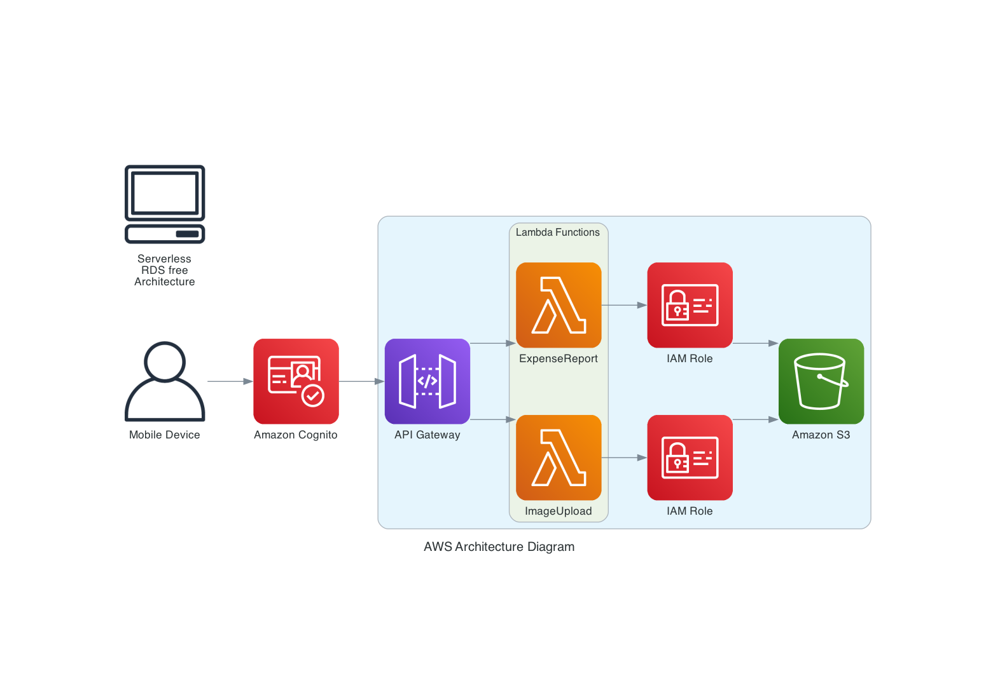

## AWS Architecture Diagram using Python

This project demonstrates how to use Python and the `diagrams` library to create a visual representation of an AWS architecture. The architecture includes services such as Amazon Cognito, API Gateway, Lambda functions, and Amazon S3, with IAM roles and a custom key/legend.

### AWS Serverless/RDS Free Architecture Diagram



This diagram visually represents the architecture described below.

### Prerequisites

- Python 3.6 or higher
- `diagrams` library
- `graphviz` installed

### Installation

1. **Create and activate a virtual environment:**

   ```bash
   python -m venv venv
   source venv/bin/activate  # On Windows: venv\Scripts\activate
   ```

2. **Install the required packages:**

   ```bash
   pip install diagrams
   ```

3. **Install Graphviz:**

   - On macOS:

     ```bash
     brew install graphviz

     ```

   - On Ubuntu/Debian:

     ```bash
     sudo apt-get install graphviz
     ```

   - On Windows:
     Download and install from the [Graphviz website](https://graphviz.gitlab.io/download/).

### Usage

This project includes a Python script that generates an AWS architecture diagram. The architecture is as follows:

- **Mobile Device** connects to **Amazon Cognito**.
- **Amazon Cognito** connects to an **API Gateway**.
- **API Gateway** branches to two **Lambda Functions**.
- Both **Lambda Functions** are connected to **Amazon S3** with **IAM Roles**.
- A custom key/legend is included in the bottom right corner.

### Python Script

Here is the Python script used to generate the diagram:

```python
from diagrams import Diagram, Cluster
from diagrams.aws.compute import Lambda
from diagrams.aws.network import APIGateway
from diagrams.aws.security import Cognito, IAM
from diagrams.aws.storage import S3
from diagrams.aws.general import User
from diagrams.onprem.client import Client

with Diagram("AWS Architecture Diagram", show=False):
    client = User("Mobile Device")
    cognito = Cognito("Amazon Cognito")

    with Cluster(""):
        api_gateway = APIGateway("API Gateway")

        with Cluster("Lambda Functions"):
            lambda_1 = Lambda("ImageUpload")
            lambda_2 = Lambda("ExpenseReport")

        s3 = S3("Amazon S3")

        # Adding IAM roles between Lambda functions and S3
        iam_role_1 = IAM("IAM Role")
        iam_role_2 = IAM("IAM Role")

        api_gateway >> lambda_1
        api_gateway >> lambda_2

    client >> cognito >> api_gateway
    lambda_1 >> iam_role_1 >> s3
    lambda_2 >> iam_role_2 >> s3

    # Adding a key/legend in the bottom right corner
    key = Client("Serverless\nRDS free\nArchitecture")
```

#### Running the Script

To generate the diagram, run the script:

```bash
python aws_diagram_with_iam_and_key.py
```

The generated diagram will be saved as `AWS Architecture Diagram.png`.

### Additional Information

The `diagrams` library allows for the creation of various types of diagrams using different cloud providers and on-premise resources. For more information, refer to the [diagrams documentation](https://diagrams.mingrammer.com/docs/getting-started/installation).

### License

This project is licensed under the MIT License - see the [LICENSE](LICENSE) file for details.
